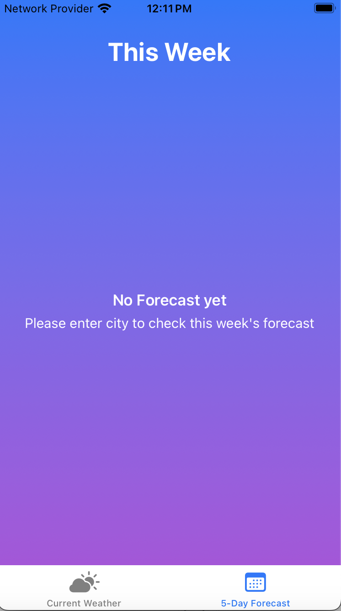
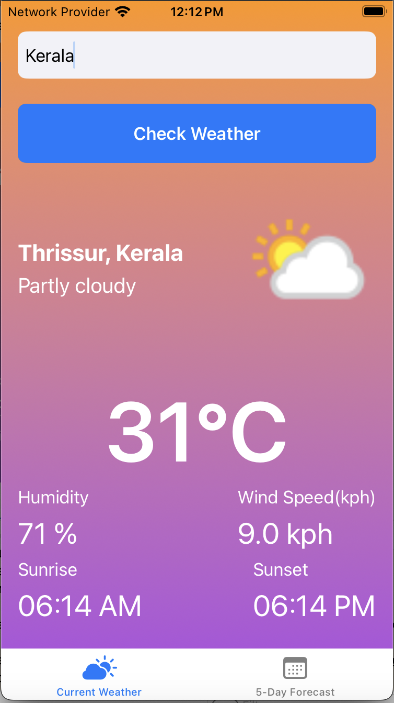

# Weather Forecasting App

## Overview

The Weather Forecast App is an iOS application that provides users with real-time weather conditions and a 5-day forecast for any location. 

The app is built using SwiftUI and integrates with a weather API for fetching data. It follows the MVVM (Model-View-ViewModel) architecture to ensure a clean separation of concerns and better state management. Additionally, Core Data is used to cache weather data, reducing the number of API requests and improving performance.


## Table of Contents
- [Features](#features)
- [Assumptions](#assumptions)
- [Architecture](#architecture)
- [Project Folder Structure](#project-folder-structure)
- [API Integration](#api-integration)
- [Installation](#installation)
- [Core Data Caching](#core-data-caching)
- [Error Handling](#error-handling)
- [Requirements](#requirements)
- [Dependencies](#dependencies)
- [Set Up Instructions](#set-up-instructions)
- [Usage](#usage)
- [Contributing](#contributing)
- [Known Issues and Limitations](#known-issues-and-limitations)
- [Executing Tests](#executing-tests)
- [Viewing Coverage Reports](#viewing-coverage-reports)
- [Screenshots](#screenshots)


## Features

- **Current Weather**: Displays the current temperature, weather conditions, humidity, and wind speed, sunrise , sunset.
- **5-Day Forecast**: Provides weather predictions for the next five days, including temperature highs, lows, and conditions.
- **Location Search**: Users can search for weather data by entering city name.
- **Error Alerts**: Alerts and appropriate messaging for failed requests or bad inputs.


## Assumptions

- The user has a stable internet connection to fetch real-time weather data. If not, cached data will be shown if available.
- The app assumes the entered city name  is accurate , otherwise API will fail and no data will be shown.
- The weather API key is correctly configured in the app’s.
- The user is using an iOS device with iOS 14.0+ installed, as the app is built with features and APIs available only in this version and later.
- The weather API service is operational in trial plan. If the API service is down or has rate limits, the app may show an error or use cached data (only if available)
- The app assumes that the network will return valid responses from the weather API. If invalid responses are returned, the user will be informed via an error message.


## Architecture

The app uses the **MVVM (Model-View-ViewModel)** architecture to maintain separation between the UI and business logic:

- **Model**: Responsible for holding the weather data (e.g., temperature, humidity, forecast).
- **ViewModel**: Handles the business logic of fetching and processing weather data from the API. The ViewModel interacts with Core Data to cache and retrieve data.
- **View**: Composed of SwiftUI views. It only observes changes in the ViewModel.


This ensures that:

The ViewModel is not tightly coupled to the View.

## Project Folder Structure

```
├── WeatherForecastingApp

 ├── Constants
    ├── Constants

  ├── ViewModels
    ├── WeatherViewModel

  ├── Views
    ├── ForecastView
    ├── Weather View
    ├── Content View
     
  ├── Services
    ├── WeatherService
      
  ├── Models
    ├── Weather

  ├── Info.plist

  ├── WeatherForecastingApp

  ├── Assets

  ├── Persistence
    
```
- `WeatherForecastingApp.xcodeproj`: The Xcode project file.
- `Constants/`: All types of app constants.
- `ViewModels/`: Contains business logic and data-binding code (MVVM).
- `Views/`: Contains UI components (built with SwiftUI or UIKit).
- `Services/`: Holds network-related files, such as API requests.
- `Models/`: Contains data models for weather information.
- `Assets.xcassets`: Holds image assets used in the app.
- `WeatherForecastingApp`: Defines the app's entry point.


## API Integration

The app integrates with a weather API to fetch real-time data.

- **WeatherService.swift**: This class handles network requests to fetch current weather and forecast data using URLSession. The API key is stored securely

API Example:

let url = "http://api.weatherapi.com/v1/forecast.json?key=\(apiKey)&q=\(city)&days=\(forecastDays)"


## Installation
1. Clone the repository:
   ```bash
   git clone https://github.com/yourusername/weather-forecasting-app.git

   cd your-app-name

   Run from any simulator
   ```
   
## Core Data Caching

The app uses Core Data to store and cache weather data locally. This helps improve performance and provides offline access to previously fetched weather data(if available)

- **CoreDataManager.swift**: This class is responsible for saving, fetching, and deleting weather data from Core Data.


## Error Handling

Error handling mechanisms are implemented to ensure a smooth user experience:

- **API Errors**: Displays user-friendly messages in case of invalid API responses or rate limits.

## Requirements

- iOS 14.0+
- Xcode 13.0+
- Swift 5.0+


## Dependencies

- **CoreData**: For data persistence and caching.


## Set Up Instructions

To set up the project locally, follow these steps:

1. Clone the Repository
  - git clone https://github.com/your-repo/weather-forecast-app.git
  - cd weather-forecast-app

2. Install Dependencies(if any)

3. Configure the API Key - Obtain an API key from the weather service

4. Open the Project

5. Build and Run - Select your target device and run the app via Xcode.
   

## Usage
- **Launch the App**: On launch, tab view will be displayed with two tab views
- **TabView**: TabBar is displayed at the botton with tabs - Current Weather, 5-Day-Forecast. By default, Current Weather tab is selected  
- **View Weather**: Users can view current weather and conditions and the 5-day forecast after entering city.

    Once the current weather is fetched and shown on screen , user can see 5-day-forecast clicking on another tab
- **Search for Other Locations**: Use the search bar to view weather data for other cities.


## Performance Consideration

- **API Rate Limiting**: The app reduces API requests by using Core Data for caching.


## Contributing
Contributions are welcome! To contribute:

1. Fork the repository.
2. Create a feature branch (git checkout -b feature/new-feature).
3. Commit your changes (git commit -m "Added a new feature").
4. Push to the branch (git push origin feature/new-feature).
5. Create a Pull Request.


## Known Issues and Limitations

- Currently, the **app doesn't support hourly weather forecasts**, and there might be delays in weather updates for regions with slower network speeds.
- App **doesn't support current location** weather data. City is required to fetch data. 
- The app **currently defaults to using Celsius** for temperature and kilometers per hour (kph) for wind speed. There is no option to switch to Fahrenheit.

## Executing Tests

- To run your tests, select **Product > Test** from the menu or use the shortcut Command + U.
 - Alternatively, you can run specific tests by clicking the **diamond button** next to the test method name in the code editor.

 ## Viewing Coverage Reports

 Open the Coverage Report:

- Go to the **Report Navigator** by clicking the triangle icon on the left sidebar or by selecting **View > Navigators > Show Report Navigator.**
Select the most recent test run from the list.
Inspect Coverage Data:

- Click on the **"Coverage"** tab at the top of the Report Navigator to see detailed coverage information.
 
You can view coverage for each file, including the percentage of lines covered by tests.
Click on a specific file to see which lines of code were executed during the test runs (covered in green) and which were not (not covered in red).


## Screenshots







